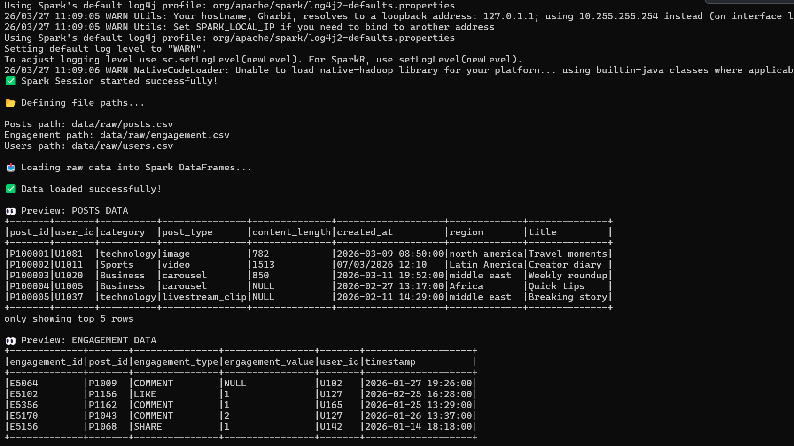
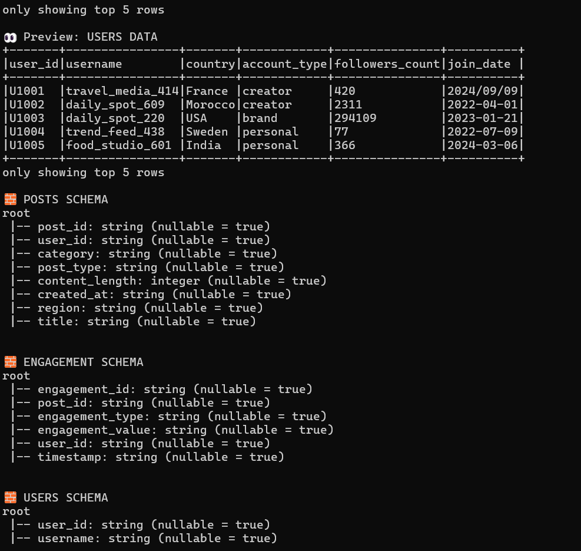
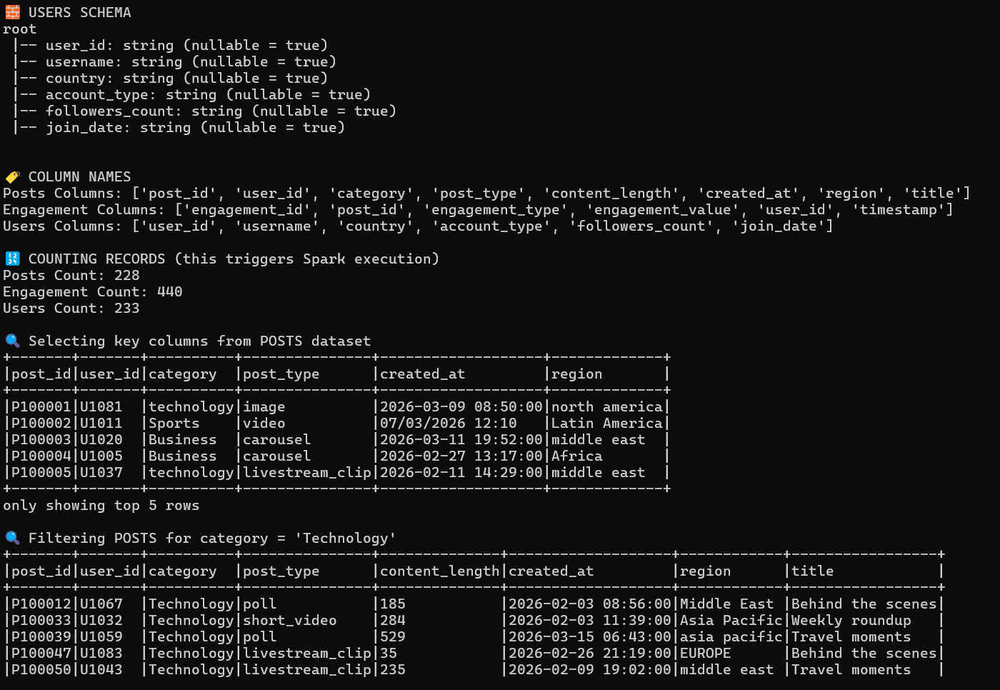
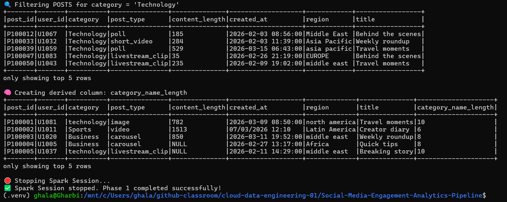

Phase 1 Checkpoint Tasks

Task 1
Run the script successfully and confirm that all three raw files are loaded into Spark. DONE

####################################

Log in WSL then navigate to project 
/mnt/c/Users/ghala/github-classroom/cloud-data-engineering-01/Social-Media-Engagement-Analytics-Pipeline

python3 -m venv .venv
source .venv/bin/activate
pip install pyspark
python3 src/phase1_raw_data_inspection.py
####################################

Task 2
Record the row counts for:

posts
engagement
users
############################
🔢 COUNTING RECORDS (this triggers Spark execution)
Posts Count: 228
Engagement Count: 440
Users Count: 233
############################

Task 3
Write down the schema observations:

Which columns are strings?
Which columns are numeric?
Are any columns inferred differently than you expected?

#################################
🧱 POSTS SCHEMA
root
 |-- post_id: string (nullable = true)
 |-- user_id: string (nullable = true)
 |-- category: string (nullable = true)
 |-- post_type: string (nullable = true)
 |-- content_length: integer (nullable = true)
 |-- created_at: string (nullable = true)
 |-- region: string (nullable = true)
 |-- title: string (nullable = true)

🧱 ENGAGEMENT SCHEMA
root
 |-- engagement_id: string (nullable = true)
 |-- post_id: string (nullable = true)
 |-- engagement_type: string (nullable = true)
 |-- engagement_value: string (nullable = true)
 |-- user_id: string (nullable = true)
 |-- timestamp: string (nullable = true)

🧱 USERS SCHEMA
root
 |-- user_id: string (nullable = true)
 |-- username: string (nullable = true)
 |-- country: string (nullable = true)
 |-- account_type: string (nullable = true)
 |-- followers_count: string (nullable = true)
 |-- join_date: string (nullable = true)
#################################

Task 4
Write down at least three important business columns from each dataset.

####################################
Posts Columns: ['post_id', 'user_id', 'category', 'post_type', 'content_length', 'created_at', 'region', 'title']
Engagement Columns: ['engagement_id', 'post_id', 'engagement_type', 'engagement_value', 'user_id', 'timestamp']
Users Columns: ['user_id', 'username', 'country', 'account_type', 'followers_count', 'join_date']
####################################
Task 5
Explain in your own words:

Spark DataFrame : A Spark DataFrame is like an Excel table, but it can process huge amounts of data efficiently using Spark.

Schema :  A schema defines the structure of a DataFrame.

what the difference is between a transformation and an action : A transformation is an operation that defines what you want to do with the data, but does NOT execute immediately.

An action triggers execution.

