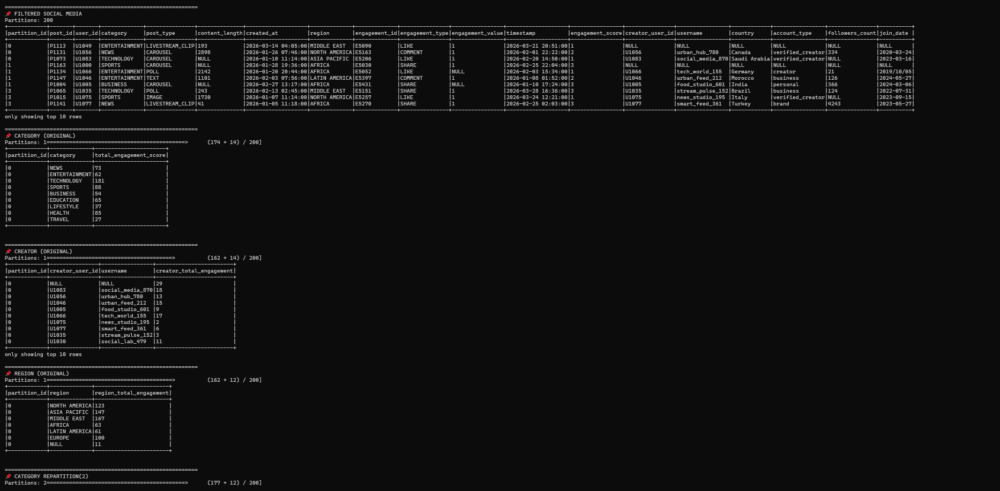
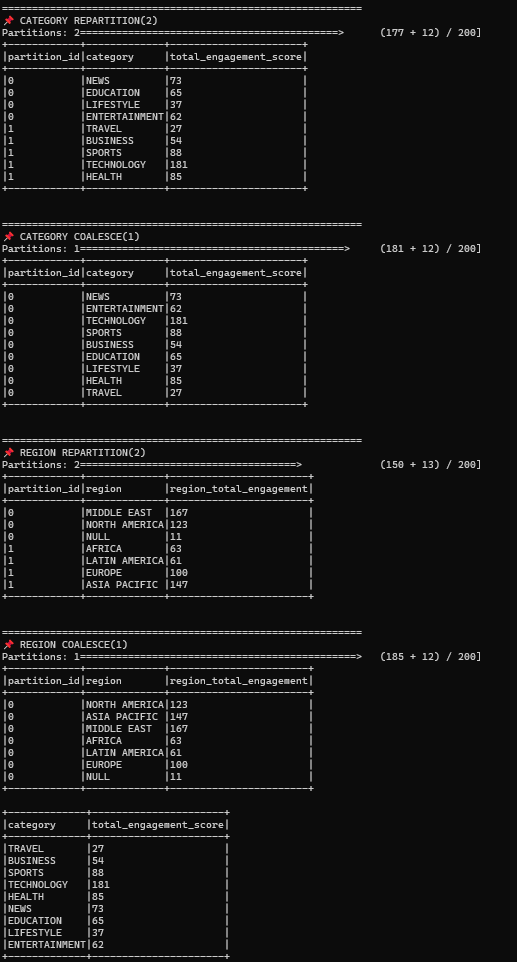
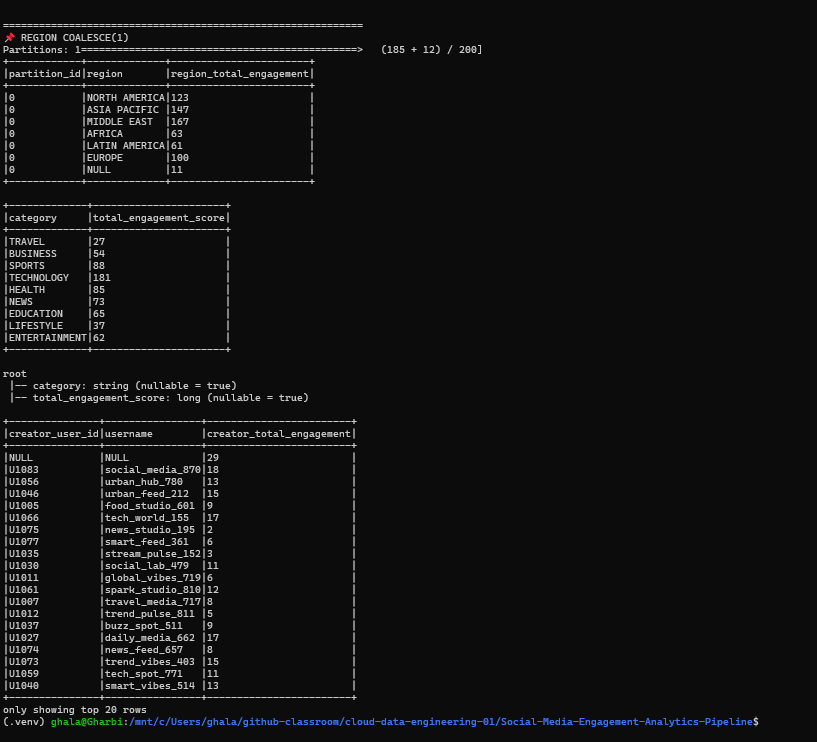

Task 1 — Why cache filtered_social_media_df?

Because it is reused multiple times (aggregations + partitions + actions). Caching avoids recomputing joins and transformations every time.

Task 2 — What caching does in Spark

Caching stores a DataFrame in memory after first computation so Spark can reuse it instead of recalculating it again.

Task 3 — Partitions observation

Example:

filtered_social_media_df: more partitions (from joins)
category_engagement_df: fewer partitions (after groupBy)

GroupBy and joins change partition distribution due to shuffle.

Task 4 — repartition vs coalesce
repartition() → full shuffle, can increase or decrease partitions, expensive
coalesce() → reduces partitions without full shuffle, cheaper

Task 5 — Small files problem

Too many small files slow down:

reading performance
storage metadata operations
downstream processing

Task 6 — What is Parquet?

Parquet is a column-based file format optimized for fast and efficient analytics.

Task 7 — CSV vs Parquet
Easier for humans: CSV
Better for analytics: Parquet

Parquet is faster, compressed, and reads only needed columns.

Task 8 — Why PostgreSQL is still useful

PostgreSQL is useful for transactional systems, real-time queries, and serving data to applications, while Spark is mainly for large-scale processing.